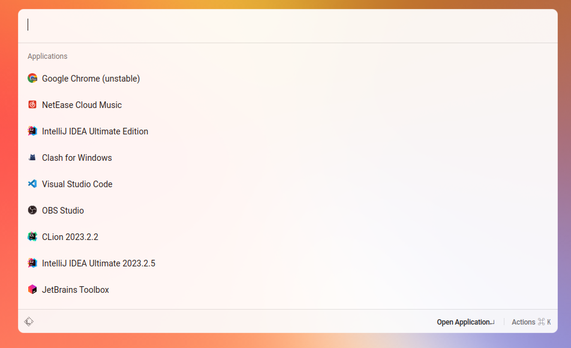

# launcher

A launcher like raycast, but for linux



## Install

```bash
go install github.com/wailsapp/wails/v2/cmd/wails@v2.5.1
git clone https://github.com/fzdwx/launcher.git
cd launcher
wails build
./build/bin/launcher
```

## Requirements

1. xclip: `yay -S xclip`

## Build your owner extension

You can use  [template](https://github.com/fzdwx/launcher-extension-sample) as a first step in developing extensions

reference:

1. https://github.com/fzdwx/launcher-github-repository-search
2. https://github.com/fzdwx/launcher-extension
